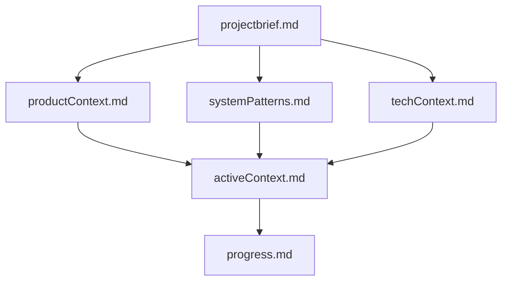
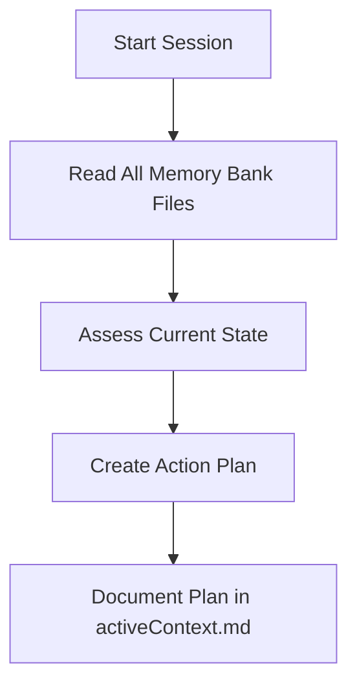
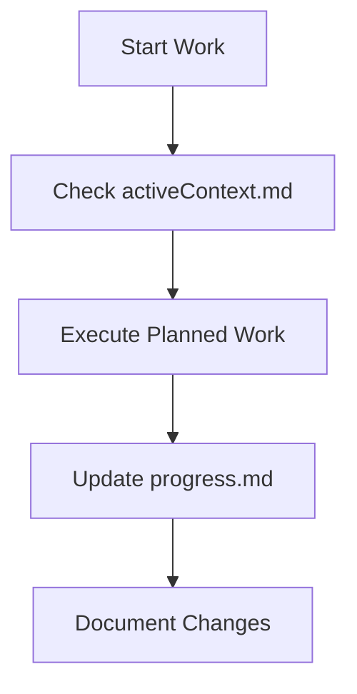

# Memory Bank - Kyperus Storefront

## Tổng quan
Memory Bank là hệ thống documentation toàn diện cho dự án Kyperus Storefront, được thiết kế để đảm bảo tính liên tục và hiệu quả trong quá trình development khi memory được reset giữa các sessions.

## Cấu trúc Memory Bank

## Files Core (Bắt buộc)

### 1. `projectbrief.md`
- **Mục đích:** Foundation document định nghĩa core requirements và goals
- **Nội dung:** Project overview, mục tiêu cốt lõi, yêu cầu chức năng, ràng buộc kỹ thuật
- **Update frequency:** Khi có thay đổi fundamental trong project scope

### 2. `productContext.md`
- **Mục đích:** Giải thích tại sao project tồn tại và problems được giải quyết
- **Nội dung:** User journey, target audience, competitive advantages
- **Update frequency:** Khi có insights mới về user needs hoặc market position

### 3. `systemPatterns.md`
- **Mục đích:** System architecture và key technical decisions
- **Nội dung:** Component patterns, data flow, animation system, code organization
- **Update frequency:** Khi implement new patterns hoặc architectural changes

### 4. `techContext.md`
- **Mục đích:** Technologies used, development setup, technical constraints
- **Nội dung:** Stack details, environment setup, performance constraints, known technical debt
- **Update frequency:** Khi upgrade dependencies hoặc change development setup

### 5. `activeContext.md`
- **Mục đích:** Current work focus, recent changes, next steps
- **Nội dung:** Latest modifications, active decisions, pending items, current challenges
- **Update frequency:** Thường xuyên nhất - sau mỗi major change hoặc khi start new work

### 6. `progress.md`
- **Mục đích:** Track what works, what's left to build, current status
- **Nội dung:** Completed features, in-progress work, technical debt, known issues
- **Update frequency:** Weekly hoặc khi complete major features

## Cách Sử dụng Memory Bank

### Khi Bắt đầu Session Mới
1. **Đọc ALL memory bank files** để hiểu full context
2. **Check activeContext.md** để biết current focus
3. **Review progress.md** để hiểu current status
4. **Plan next actions** dựa trên documented next steps

### Khi Update Memory Bank
1. **Document major changes** ngay sau khi implement
2. **Update activeContext.md** with new focus areas
3. **Update progress.md** với completed work
4. **Update technical files** nếu có architectural changes

### Workflow Patterns

#### Plan Mode

#### Execute Mode

## Update Triggers

### Automatic Updates (Phải làm)
- **Sau mỗi major feature completion**
- **Khi có architectural changes**
- **When user requests "update memory bank"**
- **Khi discover new patterns hoặc best practices**

### Manual Updates (Nên làm)
- **Weekly progress reviews**
- **Before major refactoring**
- **After debugging complex issues**
- **When stakeholder requirements change**

## Quality Guidelines

### Documentation Quality
- **Specific và actionable** thay vì vague descriptions
- **Include code examples** cho technical patterns
- **Vietnamese language preference** cho comments và documentation
- **Update dates** và version numbers cho tracking

### Context Preservation
- **Why decisions were made** không chỉ là what was implemented
- **Trade-offs và alternatives considered**
- **Known limitations và future improvements**
- **Dependencies giữa components và systems**

## Memory Bank Maintenance

### Weekly Review Checklist
- [ ] Update `activeContext.md` với current focus
- [ ] Review và update `progress.md` với completed work
- [ ] Check for any outdated information
- [ ] Document any new patterns discovered

### Monthly Review Checklist
- [ ] Review all files cho accuracy
- [ ] Update technical constraints nếu có changes
- [ ] Assess if project brief needs updates
- [ ] Plan documentation improvements

## Integration với Development Workflow

### Git Integration
- Memory bank files được tracked trong git
- Commit changes cùng với code changes
- Use meaningful commit messages cho documentation updates

### IDE Integration
- Memory bank được reference trong .cursorrules
- Cursor AI sẽ read these files để understand project context
- Consistent với Cursor's Memory Bank patterns

## Best Practices

### Do's ✅
- Read ALL files khi start new session
- Update documentation immediately after major changes
- Use Vietnamese cho internal documentation
- Include specific examples và code snippets
- Track decisions và their reasoning

### Don'ts ❌
- Don't let documentation lag behind code
- Don't document implementation details that change frequently
- Don't use vague descriptions without actionable information
- Don't skip updating activeContext.md after major work

## Troubleshooting

### Common Issues
1. **Outdated Information**
   - Solution: Regular review cycles và immediate updates

2. **Missing Context**
   - Solution: Document not just what but why

3. **Inconsistent Updates**
   - Solution: Make documentation part of definition of done

### Recovery Procedures
Nếu memory bank becomes outdated:
1. Start với project brief validation
2. Update technical context với current state
3. Rebuild progress tracking từ git history
4. Update active context với current reality

## Future Improvements
- Automated documentation generation từ code
- Integration với project management tools
- Performance metrics tracking
- Automated outdated content detection

---

**Note:** Memory Bank này được design để work với Cursor AI's memory reset pattern. Maintaining accuracy và completeness là critical cho productivity. 