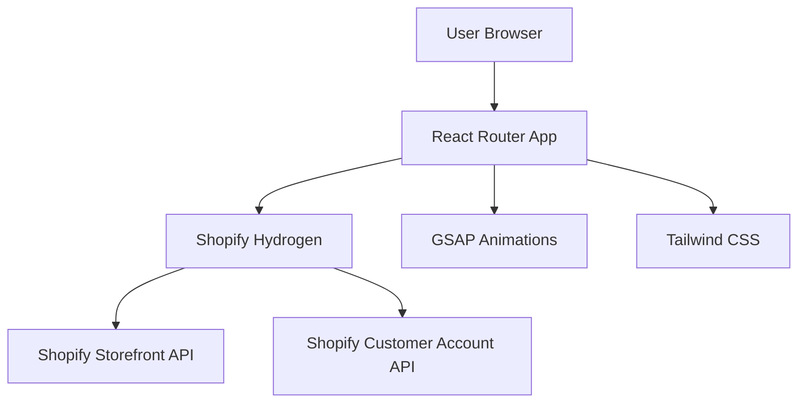

# Product Context - Kyperus Storefront

## Tại sao Dự án này Tồn tại
Kyperus Storefront được tạo ra để cung cấp một trải nghiệm mua sắm trực tuyến độc đáo, kết hợp giữa công nghệ hiện đại và văn hóa truyền thống Việt Nam. Đây là một Shopify Hydrogen storefront được thiết kế để mang lại hiệu suất cao và trải nghiệm người dùng xuất sắc.

## Vấn đề Được Giải quyết
### 1. Hiệu suất Website Thấp
- **Vấn đề:** Các e-commerce site truyền thống thường chậm và không tối ưu
- **Giải pháp:** Sử dụng Hydrogen với React Router để có hiệu suất cao và server-side rendering

### 2. Thiếu Bản sắc Văn hóa
- **Vấn đề:** Các website thương mại điện tử thiếu yếu tố văn hóa địa phương
- **Giải pháp:** Tích hợp chủ đề Kyperus với các yếu tố truyền thống trong design

### 3. Trải nghiệm Người dùng Tĩnh
- **Vấn đề:** Giao diện web thương mại điện tử thường nhàm chán và thiếu tương tác
- **Giải pháp:** Sử dụng GSAP để tạo animations mượt mà và engaging

## Cách Hệ thống Hoạt động
### Architecture Overview

### User Journey
1. **Landing Page:** Hero section với animated mask effect
2. **Product Discovery:** Browse collections và search functionality
3. **Product Detail:** Rich media presentation với animations
4. **Shopping Cart:** Smooth add-to-cart và checkout experience
5. **Account Management:** Customer authentication và order history

## Mục tiêu Trải nghiệm Người dùng
### Performance Goals
- **First Contentful Paint:** < 1.5s
- **Largest Contentful Paint:** < 2.5s
- **Cumulative Layout Shift:** < 0.1
- **Time to Interactive:** < 3s

### User Experience Goals
- **Intuitive Navigation:** Dễ dàng tìm kiếm và khám phá sản phẩm
- **Visual Appeal:** Giao diện đẹp mắt với văn hóa truyền thống
- **Smooth Interactions:** Animations không gây lag hoặc janky
- **Mobile Excellence:** Trải nghiệm tuyệt vời trên mobile devices

## Target Audience
### Primary Users
- **Khách hàng quan tâm đến văn hóa truyền thống**
- **Người mua sắm trực tuyến yêu thích trải nghiệm cao cấp**
- **Mobile users (70%+ traffic)**

### User Expectations
- Fast loading times
- Beautiful visual design
- Easy checkout process
- Reliable search functionality
- Responsive customer support

## Competitive Advantages
1. **Cultural Integration:** Độc đáo với chủ đề văn hóa Việt Nam
2. **Performance Excellence:** Hydrogen stack cho tốc độ cao
3. **Animation Quality:** GSAP cho trải nghiệm visual tuyệt vời
4. **Modern Stack:** Latest React Router và Shopify APIs
5. **Mobile Optimization:** Mobile-first approach 